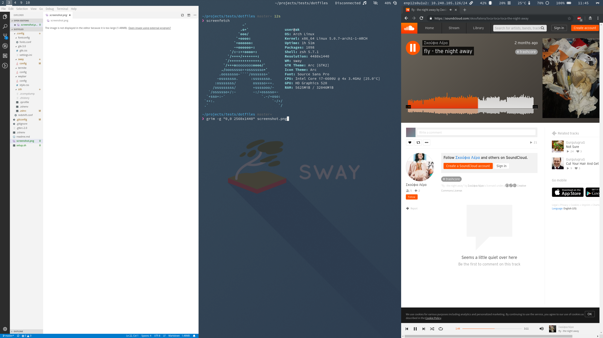

Core:
- `base-devel`
- `openssh`

Community:
- `arc-gtk-theme`
- `arc-icon-theme`
- `bemenu`
- `code`
- `mako`
- `sway`
- `waybar`
- `pcmanfm`
- `imv`
- `iwd`
- `ttf-font-awesome`
- `ttf-joypixels`
- `wl-clipboard`

Extra:
- `adobe-source-code-pro-fonts`
- `adobe-source-sans-pro-fonts`
- `adobe-source-serif-pro-fonts`
- sudo pop up
    - `polkit`
- run X clients under wayland
    - `xorg-server-xwayland`
- pulseaudio + ui
    - `pulseaudio`
    - `pavucontrol`
- bluetooth and pulseaudio support
    - `bluez`
    - `bluez-utils`
    - `pulseaudio-alsa`
    - `pulseaudio-bluetooth`
- `meld`
- `htop`
- `git`
- `evince`

Aur:
- `j4-dmenu-desktop`
- `prezto-git`
- `redshift-wayland-git`
- `termite-nocsd`
- `rambox-bin`
- `google-chrome`
- `yay`
- `emoji-keyboard`
